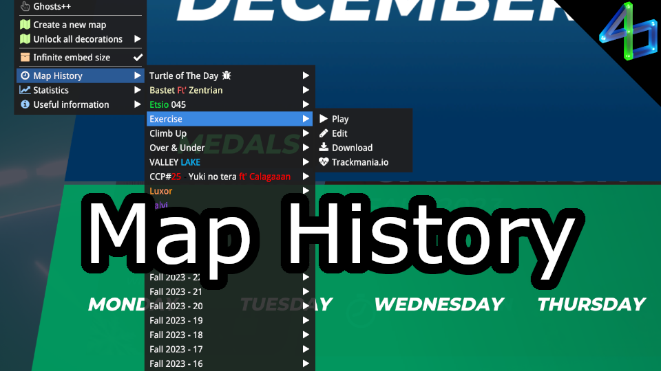

# Map History

For the last maps you've played (default 25, configurable), you can easily access them in a menu and do the following:

- play (**paid access required**)
- open in editor
- download
- open its Trackmania.io page

This plugin is the successor to "Download Map." I created DM without thinking about extra features, and now its name is very restrictive.

